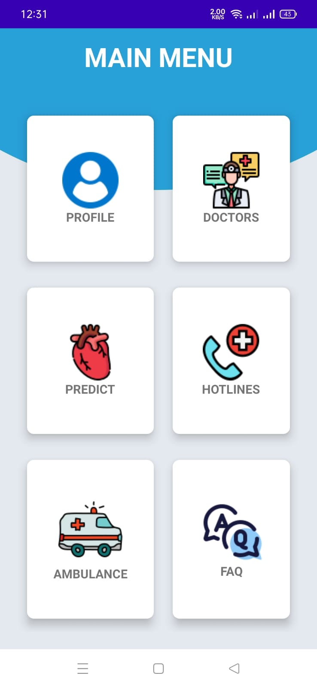
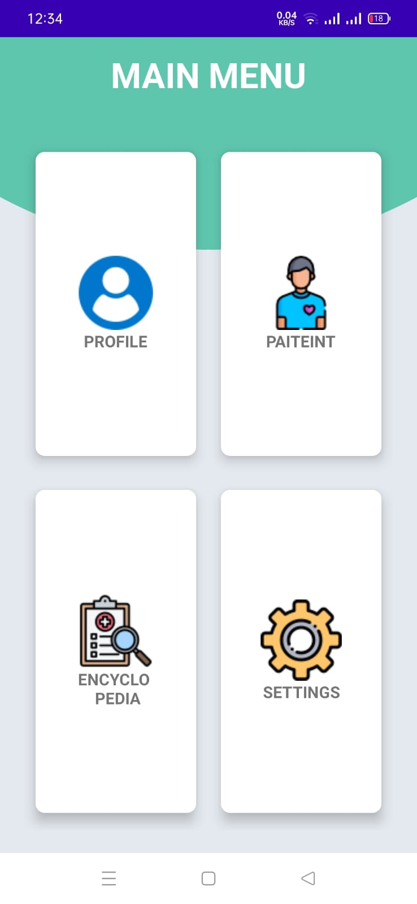
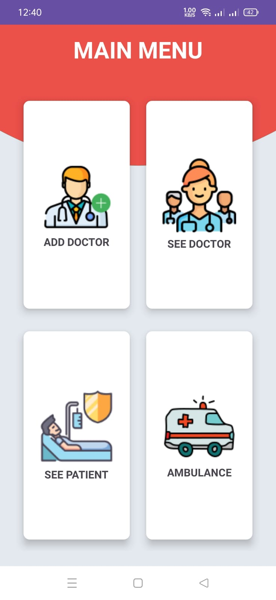
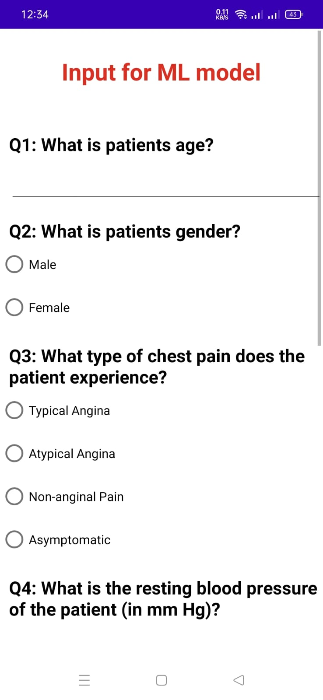
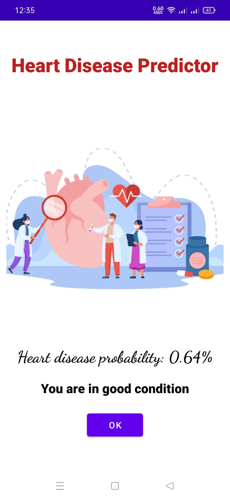
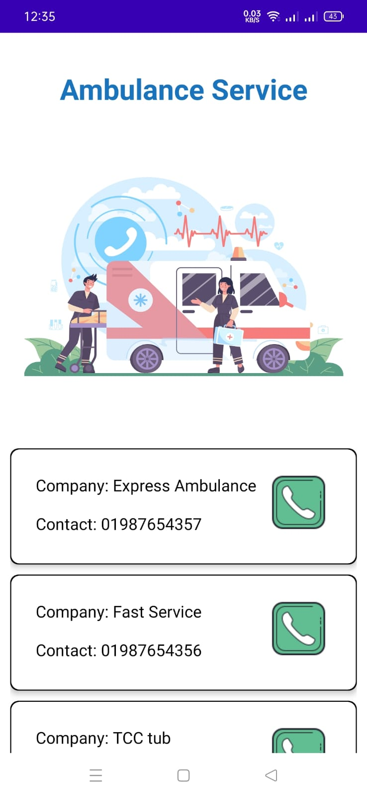

# CardioCare - An Android Application for Healthcare Management with ML solution

# Overview
CardioCare is an advanced Android application designed to improve healthcare accessibility and management. The app bridges the gap between patients and doctors by offering telemedicine services, appointment scheduling, and AI-driven heart disease predictions.

Developed as part of the **System Development Project** under the supervision of **Md. Motaleb Hossen Manik**, this project incorporates modern technologies and design principles to deliver an efficient and user-friendly healthcare solution.

    
    
    

<!-- Second Row -->

    
    
    

## Features
### Patient Features
- **Login & Signup:** Secure authentication using Firebase.
- **Find Doctors:** Search and filter doctors by specialty, fees, or name.
- **Heart Disease Predictor:** Predict heart disease risks using an integrated machine-learning model.
- **Emergency Services:** Access ambulance services and emergency hotlines.
- **Profile Management:** Edit profiles, calculate BMI, and review prescriptions.

### Doctor Features
- **Patient Monitoring:** View patient records and history.
- **Prescription Management:** Add or edit prescriptions for patients.
- **Medical Resources:** Access disease and medication details.

### Admin Features
- **System Management:** Add/edit doctors, view patients, and manage ambulance services.
- **Data Oversight:** Monitor patient and doctor activities.

---

## Technologies Used
- **Android Studio** for app development.
- **Firebase** for authentication and database management.
- **Google Colab** for training the heart disease predictor ML model.
- **TensorFlow Lite** for deploying the ML model on mobile devices.
- **Figma** for UI/UX design.

---

## Machine Learning Model

The is an advanced machine learning-based diagnostic solution built on integrated datasets and enriched with deep learning, ensemble methods, and modern explainability techniques like SHAP and LIME.

---

## 🚀 Features

- ✅ **Preprocessing**: Handles missing values, outlier detection, and normalization.
- 🔄 **Dataset Integration**: Combines 5 benchmark datasets (Cleveland, Hungarian, Switzerland, VA, Statlog).
- 🔍 **Class Balancing**: Uses SMOTE for handling class imbalance.
- 📊 **Feature Engineering**: Feature importance using permutation, SHAP, and LIME.
- 🧠 **Models**:
  - XGBoost, LightGBM, CatBoost
  - Deep Neural Networks (Autoencoder architecture)
  - Ensemble & Stacking Classifiers
- 📈 **Model Evaluation**: Accuracy, Precision, Recall, F1-Score, ROC-AUC
- 🎯 **Explainability**: Visual interpretations using SHAP and LIME
- 📉 **Learning Curves & Correlation Heatmaps**

---

## 🗂️ Dataset

- **Sources**:
  - `processed.cleveland.data`
  - `processed.hungarian.data`
  - `processed.switzerland.data`
  - `processed.va.data`
  - `statlog_space_separated.data`

- **Features**: `age`, `sex`, `cp`, `trestbps`, `chol`, `fbs`, `restecg`, `thalach`, `exang`, `oldpeak`, `slope`, `ca`, `thal`, `num`

- **Target**: `num` (0 = No Heart Disease, 1 = Heart Disease)

---

## 🛠️ Technologies Used

- Python, Pandas, NumPy, Matplotlib, Seaborn, Altair
- Sklearn, XGBoost, LightGBM, CatBoost
- TensorFlow / Keras (Neural Network)
- Imblearn (SMOTE)
- SHAP, LIME, Permutation Importance
